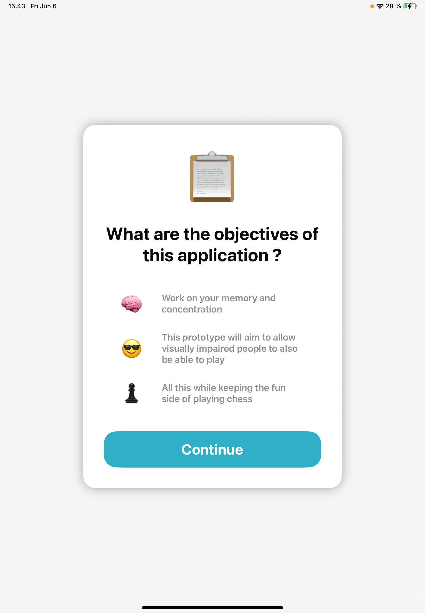
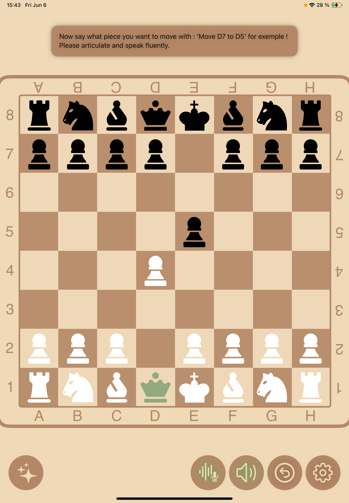
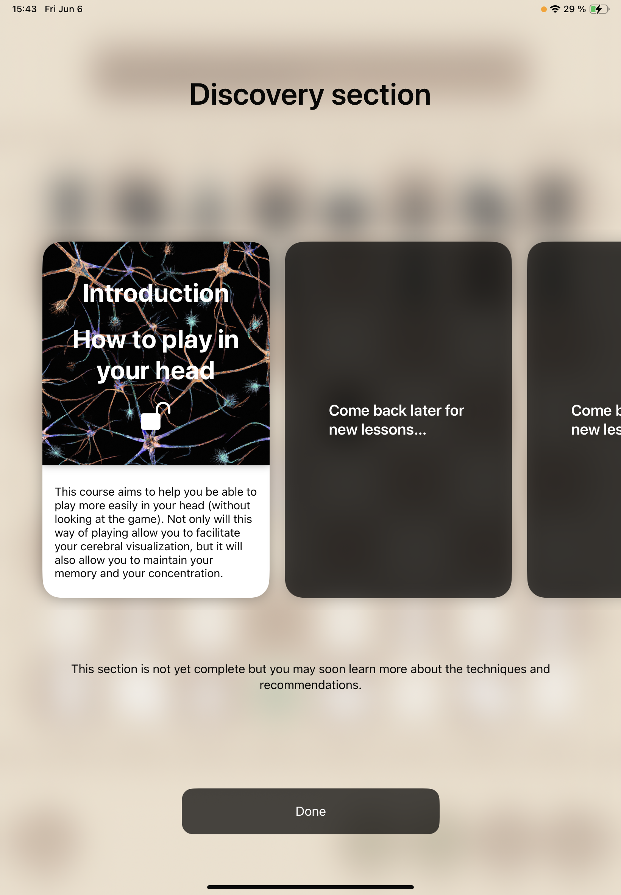

# MindChess

> Play chess entirely by voice — no board to touch, no board to look at.

## Context
Swift Student Challenge 2024 — solo project, second year of engineering school.
My first Apple Swift Student Challenge win.

## What it does
- **Play** a full game of chess hands-free, by voice command
- **Learn** mode: a small built-in course to start playing without looking at the board
- **Audio feedback** on every move — it reads back the move played so you can confirm the command was understood, and tells you when a move is illegal

```
You:   "Knight to f3"
App:   "Knight f3."          ← move confirmed and played
You:   "Bishop to e9"
App:   "Illegal move."       ← rejected, board unchanged
```

## Stack
Swift · Speech (Apple speech recognition) · AVFoundation (text-to-speech) · CreateML (custom model attempt)

## My role
Everything: design, the chess logic, voice command parsing, the spoken feedback, the learn-to-play-blind course, and the experiments around speech recognition.

## On the speech model
Apple's built-in recognition wasn't great in French, so I tried training my own
CreateML model. I even built a companion app, **Record Assets**, to collect voice samples from people around me. In the end I didn't have enough samples — or enough different voices — for it to be reliable, and since the Challenge is in English I couldn't train an English model either (no one around me had a good enough accent).
So I fell back to Apple's recognition and customized it as far as it would go.

> Companion app: **Record Assets** — built for this project to collect the voice samples. [→ repo](https://github.com/<username>/record-assets)

## Vision
The idea came from two places: the fascination of playing chess blindfolded — like
in *The Queen's Gambit* — and my grandmother, who loved chess but could play less
and less as her sight failed. MindChess is meant to let you learn to play without
looking, and to let visually-impaired players keep playing.

## Demo

1 - This is a compact onboarding menu that explains the app's purpose and key features.



2 - This screenshot shows the playable board with a short tutorial at the top. You can disable speech recognition, turn off audio feedback, go back, or open settings.



3 - This is the learn mode section, designed to teach you how to play chess mentally.

